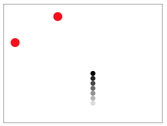

# warsawjs-workshop-25-snake

**[WarsawJS](https://warsawjs.com/) Workshop#25**: Snake :snake: - remake of a classic mobile game in React and SVG

## Features

### Essential

* :twisted_rightwards_arrows: Ability to move the snake's  head in the main four directions (:arrow_left::arrow_up::arrow_right::arrow_down:). The board is continuous - eg. crossing the right edge makes the snake appear on the left edge.
* :apple: Emerging of edible fruits at random time and places which make the snake grow
* :speak_no_evil: Game over when snake's head touches another part of its body
* :hourglass: Pausing the game
* :1234: Displaying live score of the game (running time, lenght of the snake)

### Optional

* :grapes::ice_cream::banana: Different shapes of the fruits.
* :trollface: A fun snake's head
* :gear: Settings panel where you can adjust the speed, size of the board and more live
* :family: Second player's snake directed by WSAD keys
* :arrow_right_hook: Ability to turn snake's head by an arbitrary degree
* :camera: Export screenshot of the game's board to an .svg file
* :bulb: Your ideas!

## Step by step

1. Get the [latest stable version of Node](https://nodejs.org/en/) installed on your machine
2. Follow the [create-react-app](https://github.com/facebook/create-react-app) guide to create a basic React project named `warsawjs-workshop-25-snake`
3. Create a new public repository on GitHub called `warsawjs-workshop-25-snake` and commit the initial version
4. Code all essential features and as many optionals as you like
5. [Deploy your app to GitHub pages](https://github.com/facebook/create-react-app/blob/master/packages/react-scripts/template/README.md#github-pages) for everyone to see

## Resources

- https://reactjs.org/docs/getting-started.html
- https://developer.mozilla.org/en-US/docs/Web/SVG/Tutorial

Please refrain from using any third-party libraries. Let's keep the code as clean as possible. Your welcome to use any public domain SVG images available for your project.
